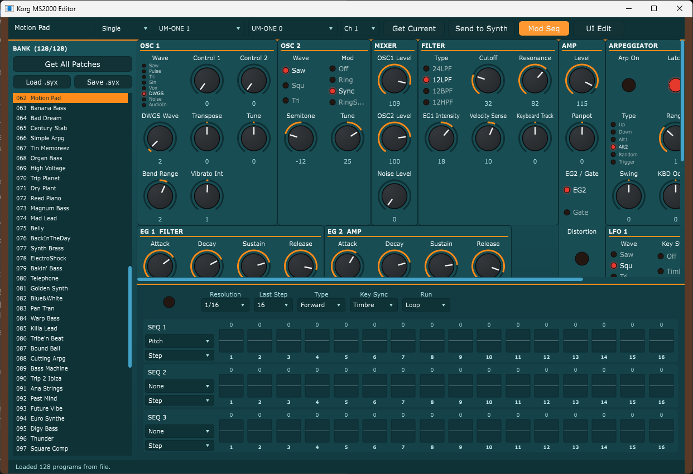
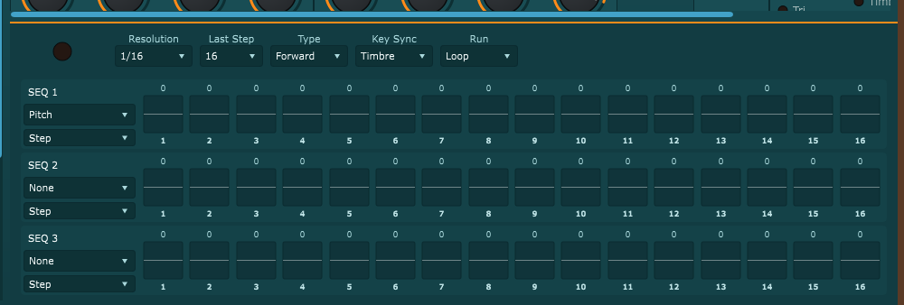

# MS2K_Interface — Korg MS2000 Editor / Librarian

A native (JUCE) editor for the **Korg MS2000 (gen-1)** that *de-multiplexes* the hardware: the
physical synth shares 5 LCD knobs + 2 EDIT-SELECT dials across ~16 parameter pages, and uses
cycling buttons for waveform/type selection. This app gives (almost) every parameter its own
permanent, labeled control, driving the real synth over MIDI — as a **standalone app** and a
**VST3 plugin** for DAW automation.

Authoritative spec: [`docs/MS2000_param_map.md`](docs/MS2000_param_map.md) — byte-exact SysEx +
CC/NRPN map, including the Mod-Sequencer layout (single source of truth for the code).



*The de-multiplexed editor: bank librarian (left), every parameter as its own labeled control,
and the Mod-Sequencer panel along the bottom.*

## Control model (two paths)
- **Real-time:** MIDI **CC** (assignable, factory default in the spec) + **NRPN** for arp,
  virtual-patch routing, and the 16 vocoder bands.
- **Full state:** **SysEx Program Data Dump** (`F0 42 3g 58 40 … F7`, 254 B / 7→8 packed to
  291 B) — bidirectional: request the synth's edit buffer, or push a full program. Bank
  load/save via Program/All-Data dump.

MS2000 gen-1 has **DIN MIDI only** — connect via a USB-MIDI interface.

## Two builds

### Standalone app (`MS2K_Interface`)
Talks to the synth directly over **RtMidi** (JUCE's Windows MIDI *input* didn't deliver
callbacks on the dev setup). Full editor + bank librarian + the Mod-Sequencer panel.

### VST3 plugin (`MS2K Editor.vst3`) — for Reaper / any DAW
A **MIDI-effect** plugin that emits on the host's **output bus** (no RtMidi), so your edits and
automation are recorded/played by the DAW and routed to the MS2000 from the track's MIDI out.
- **Every** synth parameter *and* the Mod-Sequencer (per-step values, destinations, run
  controls) is an automatable `AudioParameterInt`, generated from the same `parameterTable()`.
- **Bidirectional:** a "Listen to synth" toggle decodes incoming **CC/NRPN** from the synth
  and moves the matching plugin control in real time (consumed so it doesn't echo back).
- **Librarian:** Load/Save `.syx`, "Get All Patches", bank list, click-to-load-and-send
  (loading seeds the *full* patch bytes incl. name, so the synth shows the real name).

## Status — v1 complete (verified on hardware)
| Piece | State |
|-------|-------|
| MIDI spec transcription incl. Mod-Seq | ✅ `docs/MS2000_param_map.md` |
| `SysexCodec` (pack/unpack, dump build/parse) | ✅ unit-tested |
| `Program` byte-model + declarative `ParameterModel` | ✅ unit-tested |
| `MidiMessages` (CC/NRPN byte builders) | ✅ unit-tested |
| `MidiEngine` (RtMidi I/O, CC/NRPN + full-dump send, dump+CC receive) | ✅ live round-trip |
| UI: de-multiplexed section grid, MS2000-style LookAndFeel, "UI Edit" drag/resize | ✅ |
| All-parameter app→synth sweep (CC/NRPN/dump) | ✅ **77/77** (`tests/verify_all.cpp`) |
| Librarian: bank list, load/save `.syx`, click-to-load + auto-send | ✅ |
| **Mod-Sequencer** (3 lanes × 16 steps) — model + panel | ✅ **60/60** (`tests/verify_modseq_hw.cpp`) |
| **VST3 plugin** — full automation, bidirectional sync, librarian | ✅ builds & runs in Reaper |

## Mod-Sequencer


3 lanes × 16 bipolar steps, each lane routed to one of 31 destinations with Smooth/Step
motion, plus the common run controls (On, Resolution, Last Step, Type, Key Sync, Run Mode).
Lives in the **Timbre-1 block, bytes 90–145** — confirmed against the Korg MIDI Implementation
*and* a real bank dump (see `docs/MS2000_param_map.md` §7). Edits send a coalesced full dump
(the per-step NRPN scaling is destination-dependent, so a dump is the byte-correct path).

### Pulling patches from the synth
1. Connect the MS2000 to a USB-MIDI interface (gen-1 is DIN-only).
2. On the synth — **Global** mode: set **MIDI Filter "SystemEx" = Enable** (off by default),
   then **WRITE** the Global settings or it reverts on the next power-cycle. Set the **MIDI
   channel**, and **Memory Protect = Off** if you'll write back.
3. **Standalone:** pick MIDI Out/In + Ch, then **Get All Patches** (request `0x1C` → 128
   programs into the BANK list) or **Get Current** (edit buffer). Click any patch to load+send.
4. **Plugin in a DAW:** route the track's MIDI **out** to the MS2000; for "Listen to synth" /
   "Get …" also route the synth's MIDI **in** to the track and arm + monitor it. Set Ch to
   match the synth.
5. **Save .syx** / **Load .syx** archive a bank. Test with no hardware via
   **Load .syx → `docs/demo_bank.syx`** (128 demo patches).

## Install (Windows)
**No build required** — grab the self-contained installers from the
[**Releases**](https://github.com/louissilvestri/MS2K_Interface/releases) page and double-click:
- **`MS2K_Interface-x.y.z-Setup.exe`** — the standalone editor (per-user, no admin; Start Menu
  + optional Desktop shortcut).
- **`MS2K-Editor-VST3-x.y.z-Setup.exe`** — the VST3 plugin, into the system VST3 folder your
  DAW scans (elevates for admin). Re-scan plug-ins in your DAW afterward.

Both bundle the statically-linked binaries and register a normal uninstaller. The installer
*sources* (Inno Setup) live in [`installers/`](installers/).

## Build
The full app + plugin build with CMake + JUCE (fetched automatically):
```sh
cmake -B build -G Ninja .
cmake --build build --target MS2K_Interface     # standalone app
cmake --build build --target MS2K_Plugin_VST3   # VST3 plugin
ctest --test-dir build                          # core unit-test suites
```
Pure-C++ core tests need no JUCE, e.g.:
```sh
g++ -std=c++17 -Wall tests/test_sysex_codec.cpp Source/midi/SysexCodec.cpp -o test_codec && ./test_codec
```
Outputs: `build/MS2K_Interface_artefacts/MS2K_Interface.exe` and
`build/MS2K_Plugin_artefacts/VST3/MS2K Editor.vst3` (both statically linked — no DLLs to ship).

**Windows toolchain note:** built/verified with Strawberry Perl's MinGW (g++ 13.2, UCRT) +
Ninja. If MSYS2 is also installed, keep `C:\Strawberry\c\bin` **ahead of** any
`\msys64\mingw64\bin` on `PATH` during the build — otherwise JUCE's `juceaide` codegen helper
loads the wrong libstdc++ and fails with exit 127. Both targets use `-static`.

## Layout
```
Source/model/    ParameterModel, Program, ModSeq
Source/midi/     SysexCodec, MidiMessages, MidiEngine, rtmidi/ (vendored)
Source/ui/       Components (section grid + UI-Edit), ModSeqPanel, MS2000LookAndFeel
Source/plugin/   PluginProcessor, PluginEditor (VST3)
Source/Main.cpp  standalone app
docs/            MS2000_param_map.md, MS2K_Hardware_Controls.csv, demo_bank.syx
tests/           unit tests (codec/model/messages) + hardware round-trips (verify_*.cpp)
```

## Acknowledgments
This project stands on prior MS2000 reverse-engineering and tooling:

- **[mlazarev/midi](https://github.com/mlazarev/midi)** — a comprehensive MS2000 MIDI/SysEx
  resource (decoder, analyzer, the transcribed Korg MIDI Implementation, offset-64 handling).
  Its documentation was used to cross-check the SysEx layout and **confirm the Mod-Sequencer
  byte offsets** (then re-verified against a real bank dump). Invaluable reference.
- **[ReMS2000](https://github.com/inteyes/ReMS2000)** (inteyes) — the open-source Ctrlr-based
  MS2000 editor that inspired the data-driven, single-table parameter model used here.
- The **Korg MS2000/2000R MIDI Implementation** (Korg Inc.) — the authoritative spec the byte
  maps in `docs/MS2000_param_map.md` are transcribed from.
- **[RtMidi](https://github.com/thestk/rtmidi)** (Gary P. Scavone, MIT-style license, vendored
  in `Source/midi/rtmidi/`) and **[JUCE](https://juce.com)** (fetched at build time).

The code here is original; the projects above are credited as references/spec sources, not as
copied code. MS2000 and Korg are trademarks of Korg Inc.; this is an unofficial, independent
editor with no affiliation.
